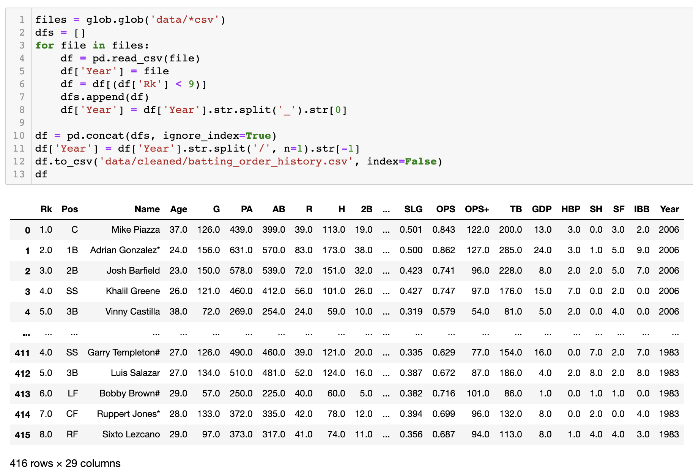

# Padres Starting Lineup Analysis OPS (1969-2020)

---

---

## Contact Information

Rob Savage 

rob.savage@me.com

[LinkedIn](https://www.linkedin.com/in/robsavage/)

[Tableau Public](https://public.tableau.com/profile/rob.savage)

---

## Project Description

Being a die-hard Padres fan, the excitement and production of the team in 2020 got me thinking about historically where this particular team sat in franchise history. OPS (On-base Plus Slugging) has become the predominant mainstream statistic in baseball, right next to Exit Velocity and Launch Angle. It is a much more all-encompassing stat that measures a players On-base Percentage--whether that be via a hit or walk, along with the quality of said player's hit being measured by the total amount of bases on that particular play. The goal here was to visualize the quality of the Padres starting lineup from 1969 to 2020 at each postiion. 

---

## Tools Used

1. Python (Data Aggregation/Cleaning)

    - Pandas Library

2. Glob (Mass CSV Merging)

3. Github (Publishing of Results and Analysis)

4. Jupyter Notebook

---

## Steps 

1. Used `Python` along with `Glob` to mass merge all of the team data `CSVs` in the `data` folder 

  - Created a `for` loop to read the files
  - Created a new column to store the year of the lineup
  - Used the `Rk` column to filter only the top 8 players, in this case the starting lineup based on how the data was organized
  - Appended the years
  - Split the data in the column to only show the current year
  - Exported to a `CSV` and new dataframe with 416 rows

---

## Analysis

Nearly every single position is in an upward climb when compared to the most recent years. There have been some sensational seasons by individual Padres in previous years, which also include some Hall of Famers with very high OPS marks, but there has never been a season until 2020 where nearly every single position saw an improvement in OPS. With the Padres reloading for 2021, we are on the precipice of a special run from the boys in brown.
